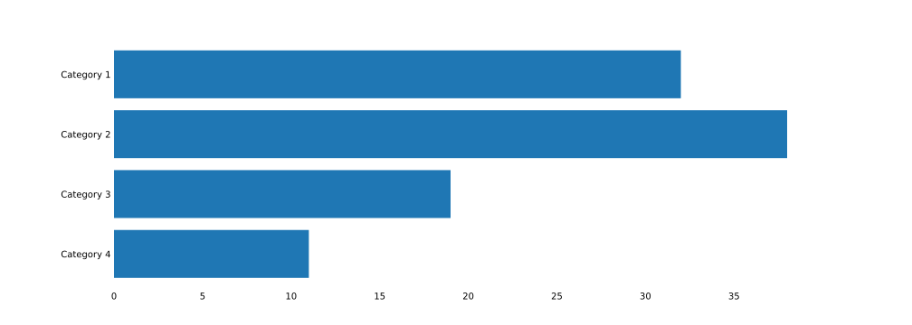
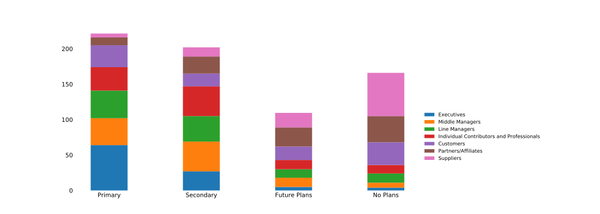
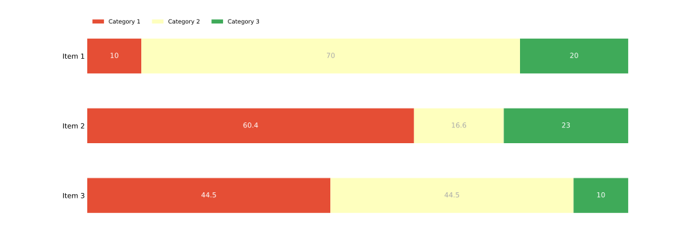
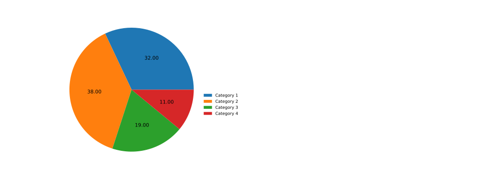

## XLS to SVG converter

Parses input `.xls` file and generates `.svg` chart of a specified type.

### Installation

Via `pip`:

```shell
pip install git+https://github.com/ZapAnton/xls_to_svg
```
or if you want to upgrade to the latest version:

```shell
pip install --upgrade git+https://github.com/ZapAnton/xls_to_svg
```

### Example Usage

```shell
xls_to_svg -t discrete_bar_chart /path/to/the/input_file_name.xls
```
This command will generate a `/path/to/the/input_file_name.svg` chart file.

### Full Interface

```text
usage: xls_to_svg [-h] [-l] [-t CHOSEN_CHART_TYPE] [xls_filepath]

Convert XLS tables into SVG charts

positional arguments:
  xls_filepath          path to the input XLS file

optional arguments:
  -h, --help            show this help message and exit
  -l, --list-chart-types
                        display all available chart types
  -t CHOSEN_CHART_TYPE, --chart-type CHOSEN_CHART_TYPE
                        sets output chart type
```

### XLS File Format

In order for the `.xls` file to be parsed, it should conform to the following format:

| Category name  | Category 1   | Category 2    | Category 3    | ...           | Category n    |
| :------------- | :----------: | :-----------: | :-----------: | :-----------: | :-----------: |
| Item 1         | 10           | 70            | 20            | ...           | value n       |
| Item 2         | 60.4         | 16.6          | 23            | ...           | value n       |
| Item 3         | 44.5         | 44.5          | 10            | ...           | value n       |
| ...            | ...          | ...           | ...           | ...           | value n       |
| Item n         | 1            | 98            | 1             | ...           | value n       |

### Supported Chart Types

- [x] Bar Chart
- [x] Stacked Bar Chart
- [x] Discrete Bar Chart
- [x] Pie Chart

### Charts Example

#### Bar Chart



#### Stacked Bar Chart



#### Discrete Bar Chart



#### Pie Chart


